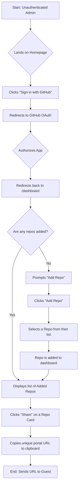

```mermaid
graph TD
    A[Start: Unauthenticated Admin] --> B{Lands on Homepage};
    B --> C[Clicks &quot;Sign in with GitHub&quot;];
    C --> D[Redirects to GitHub OAuth];
    D --> E{Authorizes App};
    E --> F[Redirects back to /dashboard];
    F --> G{Are any repos added?};
    G -- No --> H[Prompts &quot;Add Repo&quot;];
    G -- Yes --> I[Displays list of Added Repos];
    H --> J[Clicks &quot;Add Repo&quot;];
    J --> K[Selects a Repo from their list];
    K --> L[Repo is added to dashboard];
    L --> I;
    I --> M[Clicks &quot;Share&quot; on a Repo Card];
    M --> N[Copies unique portal URL to clipboard];
    N --> O[End: Sends URL to Guest];
```
