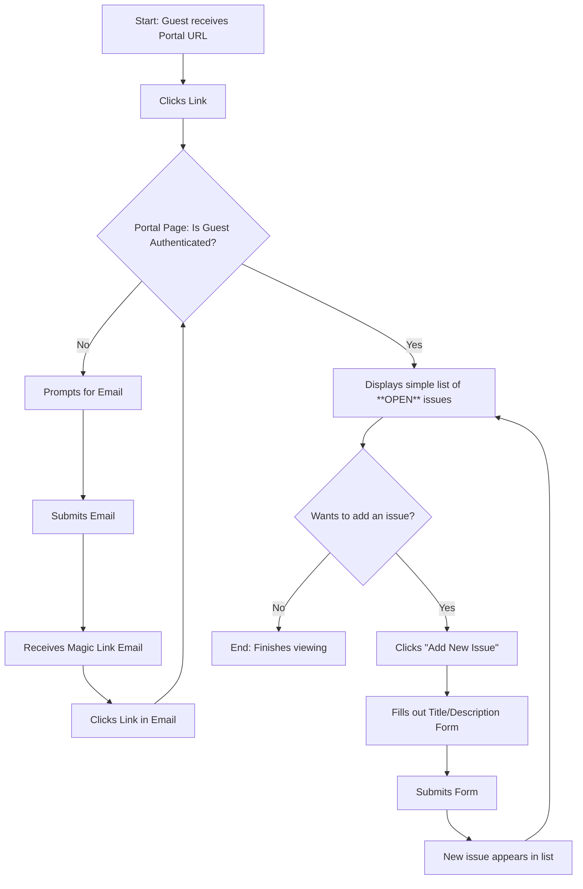

```mermaid
graph TD
    A[Start: Guest receives Portal URL] --> B[Clicks Link];
    B --> C{Portal Page: Is Guest Authenticated?};
    C -- No --> D[Prompts for Email];
    D --> E[Submits Email];
    E --> F[Receives Magic Link Email];
    F --> G[Clicks Link in Email];
    G --> C;
    C -- Yes --> H[Displays simple list of **OPEN** issues];
    H --> I{Wants to add an issue?};
    I -- Yes --> J[Clicks &quot;Add New Issue&quot;];
    J --> K[Fills out Title/Description Form];
    K --> L[Submits Form];
    L --> M[New issue appears in list];
    M --> H;
    I -- No --> N[End: Finishes viewing];
```
